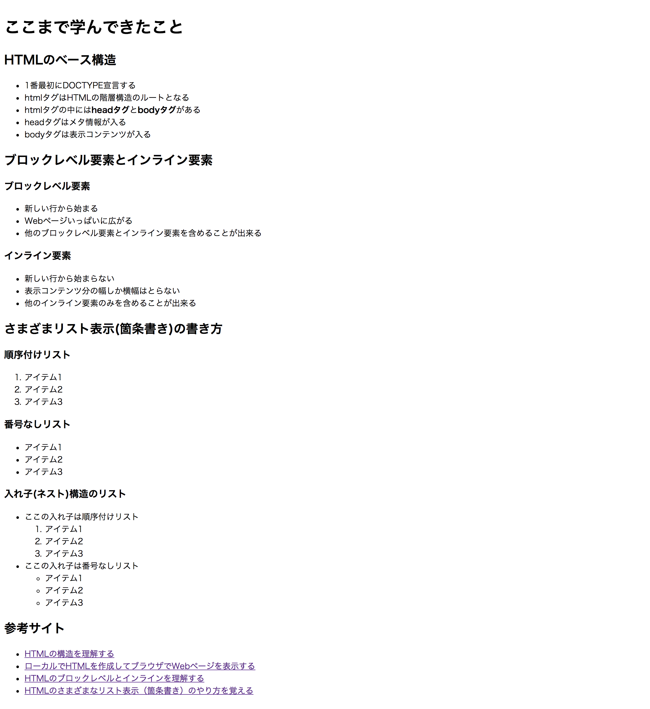

# レポジトリ内容

このレポジトリは[Web白熱教室](https://tsuyopon.xyz/)の[HTMLの学習コンテンツ](https://tsuyopon.xyz/learning-contents/web-dev/html/)である「[【エクササイズ】ここまで学んできたことの復習その1](https://tsuyopon.xyz/learning-contents/web-dev/html/excercise-html-part-1/)」で利用するものです。

## 課題

以下の画像と同じページを作ってください。

## 答え

この課題の答えは、このレポジトリの「index.html」の中身になります。
すぐに答えを見ずに、まずはじめに自分の力だけでチャレンジして、どうしてもわからなくなったら中身を見て、理解したらindex.htmlを閉じて再び自分の力で完成させてください。

## 注意点

- 上の画像の中の「HTMLのベース構造」の3つめの項目である「htmlタグの中には**headタグ**と**bodyタグ**がある」の「headタグ」「bodyタグ」は太字になっています。

## ヒント

- 文字を太くするには「bタグ」を使います
- 文字が大きくなっているところは「h1~h3」のタグを使っています
- HTMLの構造は「[HTMLの構造を理解する](https://tsuyopon.xyz/learning-contents/web-dev/html/basic-structure-of-html/)」で学習しました
- パソコン上でHTMLファイルを作成してWebブラウザで確認する方法は「[ローカルでHTMLを作成してブラウザでWebページを表示する](https://tsuyopon.xyz/learning-contents/web-dev/html/show-html-on-local-machine/)」で学習しました。
- 順序付けリスト、番号なしリスト、入れ子構造のリストは「[HTMLのさまざまなリスト表示（箇条書き）のやり方を覚える](https://tsuyopon.xyz/learning-contents/web-dev/html/how-to-make-lists/)」で学習しました

## 先取り内容

上の画像の「参考サイト」の部分では[aタグ(アンカー要素)](https://developer.mozilla.org/ja/docs/Web/HTML/Element/a)を使ってそれぞれの学習コンテンツへのリンクをセットしています。

属性についてはまだ学習していない内容で今後取り扱う内容ですが、`href`属性を使うとリンクを貼る事ができます。(参考サイト: 「[`<a>`: アンカー要素](https://developer.mozilla.org/ja/docs/Web/HTML/Element/a)」)

それぞれのリンク先は以下のとおりです。

- HTMLの構造を理解する
  - https://tsuyopon.xyz/learning-contents/web-dev/html/basic-structure-of-html/
- ローカルでHTMLを作成してブラウザでWebページを表示する
  - https://tsuyopon.xyz/learning-contents/web-dev/html/show-html-on-local-machine/
- HTMLのブロックレベルとインラインを理解する
  - https://tsuyopon.xyz/learning-contents/web-dev/html/understand-block-and-inline/
- HTMLのさまざまなリスト表示（箇条書き）のやり方を覚える
  - https://tsuyopon.xyz/learning-contents/web-dev/html/how-to-make-lists/
